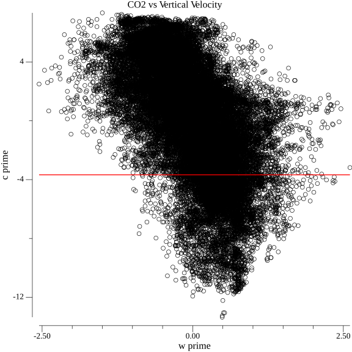
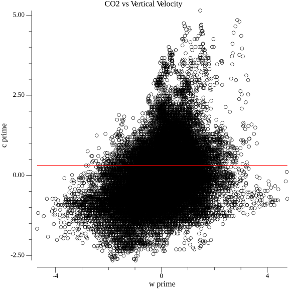

# Assignment 1, Problem 6

```shell
go get -u
go run main.go
```

# Output

## Daytime



## Nighttime



## Console

```
Stats for daytime.eddies.csv: 
Slope: -0.0000, Intercept: -3.6710, R^2: -0.5822, Covariance: -1.4126
Daytime CO2 Flux: -31077931.8925 micromoles/m^2 s

Stats for nighttime.eddies.csv: 
Slope: 0.0000, Intercept: 0.3040, R^2: 0.3432, Covariance: 0.3227
Nighttime CO2 Flux: 7098367.1619 micromoles/m^2 s
```